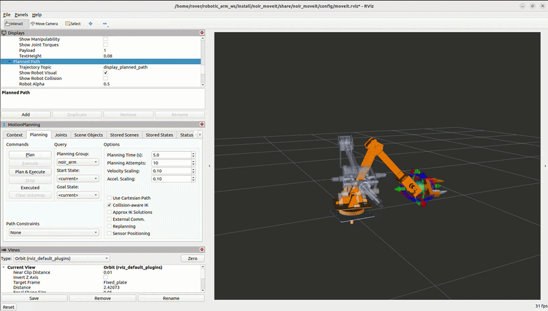

# 🤖 Robotic Arm – Rover Noir

---

## 📌 About

This repository contains the **URDF model and MoveIt configuration** of the robotic arm used in the rover **Noir**.

The arm is designed for:

* Object manipulation
* Sample collection
* Precise movement
* Motion planning using MoveIt

---

## 🖼️ Preview


---

## 🎯 MoveIt Demo



---

## 🚀 Setup & Run

```bash
# Go to your workspace
cd ~/ros2_ws/src

# Clone the repo
git clone https://github.com/your-username/Robotic_arm_Noir.git

# Go back to workspace
cd ~/ros2_ws

# Install dependencies
rosdep install --from-paths src --ignore-src -r -y

# Build
colcon build

# Source
source install/setup.bash
```

---

## ▶️ Run URDF Visualization

```bash
ros2 launch robotic_arm_urdf display.launch.py
```

---

## 🤖 Run MoveIt (Motion Planning)

```bash
ros2 launch noir_moveit demo.launch.py
```

---

## ⚙️ RViz Configuration

Once the launch file is running, RViz will open automatically.

> ⚠️ **Important:** In RViz, set the **Fixed Frame** to `Fixed_plate`
>
> `Global Options` → `Fixed Frame` → `Fixed_plate`
>
> Without this, the arm model may not display correctly.

---

## 📁 Packages Included

* `robotic_arm_urdf` → URDF, meshes, visualization
* `noir_moveit` → MoveIt configuration and motion planning

---

