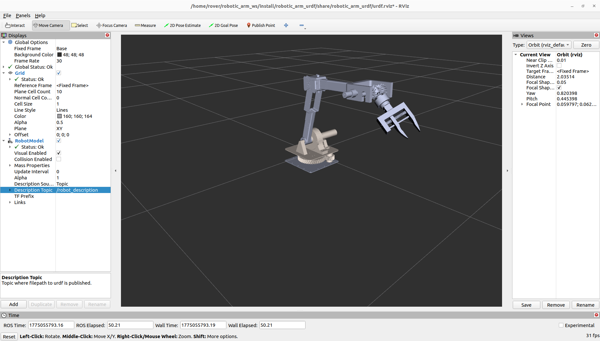
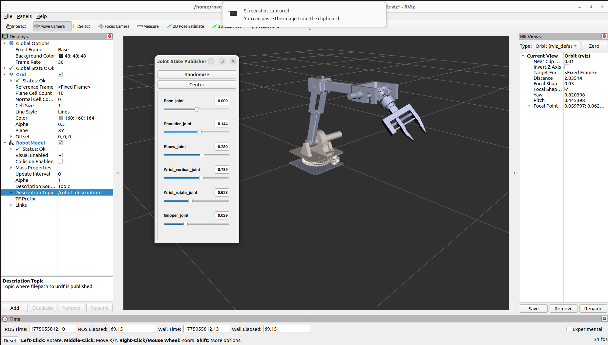

# 🤖 Robotic Arm – Rover Noir

Team Drishti | International Rover Challenge 2026

---

## 📌 About

This repository contains the **URDF model of the robotic arm** used in our rover **Noir**.

The arm is designed for:
- Object manipulation  
- Sample collection  
- Precise movement  

---

## 🖼️ Preview





---

## ⚙️ Requirements

- ROS 2 Humble

---

## 🚀 Setup & Run

```bash
# Go to your workspace
cd ~/ros2_ws/src

# Clone the repo
git clone https://github.com/your-username/Robotic_arm_Noir.git

# Go back to workspace
cd ~/ros2_ws

# Install dependencies
rosdep install --from-paths src --ignore-src -r -y

# Build
colcon build

# Source
source install/setup.bash

# Run
ros2 launch robotic_arm_urdf display.launch.py
```

---

## 👥 Contributors

- [Prakhar Dwivedi](https://github.com/prakhar-29)  
- [Jival Dhingra](https://github.com/jivalz)  

---

## 🚀 Team Drishti

Built for International Rover Challenge 2026

